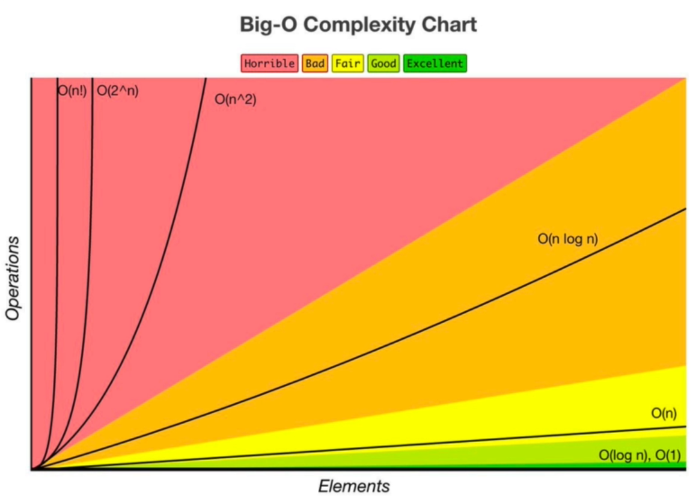

# **Full name**: "Big O Asymptomatic Analysis"

## Big O Asymptotic Analysis Cheat Sheet

**Definition:**

- **Big O Notation**: A mathematical notation to describe the upper bound of an algorithm's growth rate.
- **Asymptotic Behavior**: The performance of an algorithm as the input size approaches infinity.

**Key Points:**

1. **Asymptotic Behavior**:
   - Focuses on the algorithm's **efficiency** and **scalability** for large input sizes.
   - Helps to understand the **worst-case** performance.

2. **Big O Notation**:
   - Expressed as $O(f(n))$, where $f(n)$ represents the growth rate.
   - Example: $O(n^2)$ indicates that the time complexity grows no faster than the square of the input size.

3. **Ignoring Constants and Lower-Order Terms**:
   - Simplifies the analysis by focusing on the dominant term.
   - Example: $3n^2 + 5n + 2$ simplifies to $O(n^2)$.

**Purpose:**

- Helps **compare** the efficiency of different algorithms.
  - As you can't just go and tell people *"hey my code executed 10000 instructions in 3.2 seconds!"* as that speed is measured **on your PC** and in other PC, it may be faster or slower.
  - Thus, big-O gives the number by which speed the code will run.
- Provides a clear understanding of how algorithms perform at scale.



# What Big-O measures!?

1. **#-Elements** and **#-operations**.
2. When the #-elements grow, **by what factor** the #-operations grows?

## Types:

1. **O(n)**: Linear; When `n` elements are there, there will be `n` operations
2. **O(1)**: Constant-no loops; No matter how many elements are there, it will take exactly some constant time. *Note: If your code does 5 operations but that is constant, you still say O(1) instead of O(5).*
3. **O(log N)**: Logarithmic; usually searching algorithms.
4. **O(N log(N))**: Log linear; again sorting algos.
5. **O(2^n)**: Quadratic; every element in a collection needs to be compared to all other elements (nested for loops)
6. **O(n^2)**: Exponential; recursive algorithms that solves a problem of size N
7. **O(n!)**: Factorial; adding loop for every element!

### What can cause **time** in the function?

1. Operations (+, -, /, *)
2. Comparisons (<, >)
3. Looping
4. Other function call.

That's it!

# How to calculate Big-O for any function?

## `1.` The manual line-by-line way:

```js
function funChallenge(input) {
  let a = 10; // O(1)
  a = 50 + 3; // O(1)

  for (let i = 0; i < input.length; i++) { // O(n)
    anotherFunction(); // O(n)
    let stranger = true; // O(n)
    a++; // O(n)
  }
  return a; // O(1)
}
```

Here, you calculate the stuff line by line and then derive the total result. Here it is: O(3 + 4n) and can be simplified to `O(n)`.

## `2.` Direct, more practical way

**📜 Follow the rules!**

1. **Worst case**: Find the *worst case*. That's what big-o does. Ask: "what if the item we are looking for is at the end of the array?" that will be the worst case.
2. **Remove constants**: Ignore constant factors as they are insignificant for large input sizes.
   - That means, if you have the `O(1 + n/2 + 1001)` then ignore the constants and just keep the worst case on hand `O(n)`.
3. **Different terms for inputs**: Use separate variables for different inputs; combine with `+` for sequential steps and `∗` for nested steps.
   - This needs example:
   - Suppose the function takes 2 inputs: 1) array of males 2) array of females
   - Then we run **separate** loops on each of them
   - Now, the complexity **won't be** `O(n)`! As the loops that are there, run for separate number of elements.
   - Thus, here it will be `O(n + m)`. That's correct ;)
4. **Drop non dominants**: Eliminate terms that grow slower as they have minimal impact on the overall growth rate. *(That means drop lower scary terms; if there are `n` and `n^2` then just keep `n^2` and drop `n` ;)*

Doing these, will get you the big-O for any function.

> ### 💡
> 
> Very good thing to note: **If there are 2 sequential steps, but one comes after another, then use `+` and if both have some *nesting* then use `*`.**

# 💎 Another dimension: Memory

The same things go with **memory**. Here, the terms will be the same, just you will **count how much memory you fill in** instead of **how many operations you are making**.

