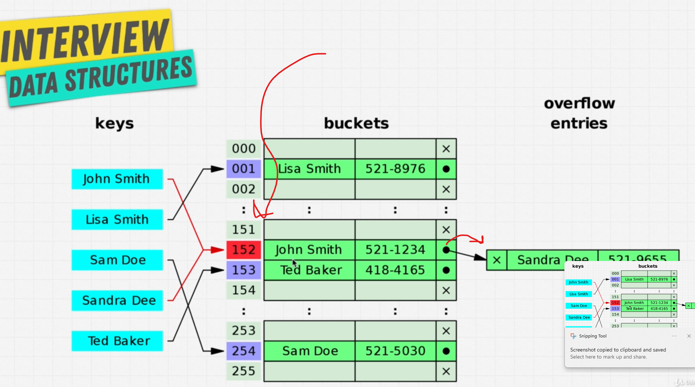

# The hash!

- insert - `O(1)`
- delete - `O(1)`
- lookup - `O(1)`
- search - `O(1)`

## ❓ Why not always use it?

### Cons

- **Hash collision**: This happens when two different inputs create exactly same hash and that may create issues in finding and allocating memory.
  - Read [this discussion](https://stackoverflow.com/questions/53119712/can-the-hash-of-2-different-inputs-be-the-same) for more.
- It is not iterable like arrays.

## Hash collision

- It stores multiple items in the same address
- Slows down the reading and writing (becomes `O(n)`)

### How is collision solved?

Many ways, but in the image it is shown as with LinkedList

For other ways: there is always [wikipedia](https://en.wikipedia.org/wiki/Hash_table).

## PROS

- Great when need to access the value very quickly
  - Array has `O(n)` and hash has `O(1)`
- Inserting is very cheap
  - Array has `O(n)` and hash has `O(1)`

## CONS

- No concept of order
- Slow key traversal