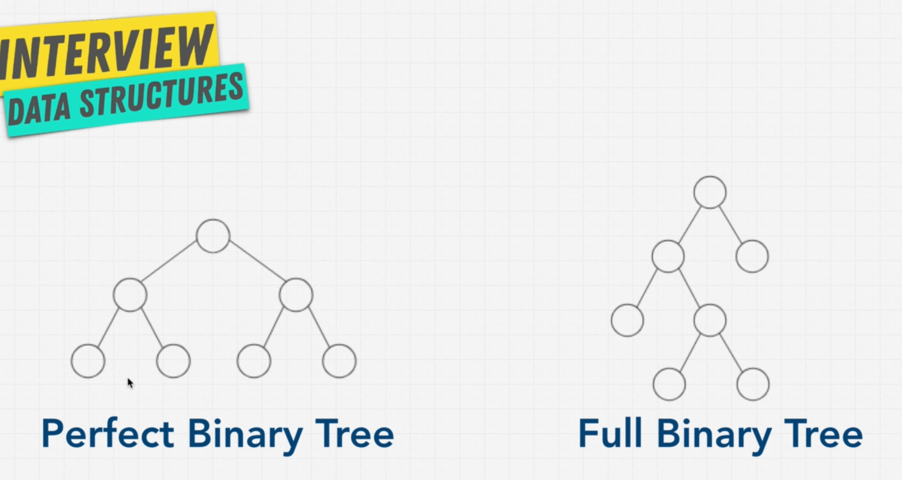

# Tree, with only 2 children

## The types:

1. Perfect binary tree
2. Full binary tree

### `1.` Perfect Binary Tree
  
- All levels are full and the tree has all leaf nodes filled in.
- The next layer will have `x2` nodes than the current layer.
- Total nodes on this layer == all nodes above + 1
  
> 🤯 The above is great: **Total nodes on this layer == all nodes above + 1** means, you will always have ***half of the data above*** than the current layer. 

👍🏻 We can organize the data in such a way that half is above and half is on this layer.  
👍🏻 This can bring much efficiancy.

## `O(log N)` - Finally!

**Trick to calculate the number of nodes based on the level**:

### Calculate **number of nodes on #th level**

- level - 0: 2^0 == `1` (root)
- level - 1: 2^1 == `2` (first)
- level - 2: 2^2 == `4` ...
- level - 3: 2^3 == `8` ...

### Calculate **total number of nodes in whole tree**

- `2^h - 1` (h == height)

>>> The `O(log N)`

👉🏻 That means, **the number of decisions that we are going to make (maximum) while finding for an item**.

Okay, not clear?

## 🍃 `log #nodes = height`

We are just saying that **you may need to make maximum # decisions** and what does `# decisions` mean? The freaking `height h`!!

- And so for that we are applying a simply formulae to calculate the height.
- The formulae is reversed, based on assumption that we have **total number of nodes** available.
- So, if we had height how would we calculate the total nodes? $2^h - 1 = N$, right?
- Just reverse it and you will get: $log(N) = h$
- That's freaking it.

## Okie-Dokie!
I think we now have certain level of confidence about the binary trees and types. Note, that the types **are not limited** to just the "perfect" and "full tree". There are many other types which are created for algorithm's simplicity and other optimization.

Next, we will learn about the BSTs, or BINARY SEARCH TREES.

---

Let's have a short summary of this Binary tree landscape:

### Types of Binary Trees

1. **Perfect Binary Tree**:
   - **Definition**: All internal nodes have two children, and all leaf nodes are at the same level.

2. **Full Binary Tree**:
   - **Definition**: Every node has either 0 or 2 children.
   
3. **Complete Binary Tree**:
   - **Definition**: All levels are fully filled except possibly the last, which is filled from left to right.
   
4. **Balanced Binary Tree**:
   - **Definition**: Height of left and right subtrees of any node differ by at most one.

5. **Degenerate (Pathological) Tree**:
   - **Definition**: Each parent node has only one child, resembling a linked list.

6. **Binary Search Tree (BST)**:
   - **Definition**: A binary tree where left child < parent node < right child for every node.

### Key Differences

- **Perfect vs. Complete**:
  - **Perfect**: All levels completely filled, all leaves at the same level.
  - **Complete**: All levels except the last are completely filled; last level filled left to right.

### Relationships

- **BST**:
  - Can be any structural type (perfect, complete, full, balanced) as long as it satisfies the ordering property (left < parent < right).

---

👋🏻 See you in the next one!
