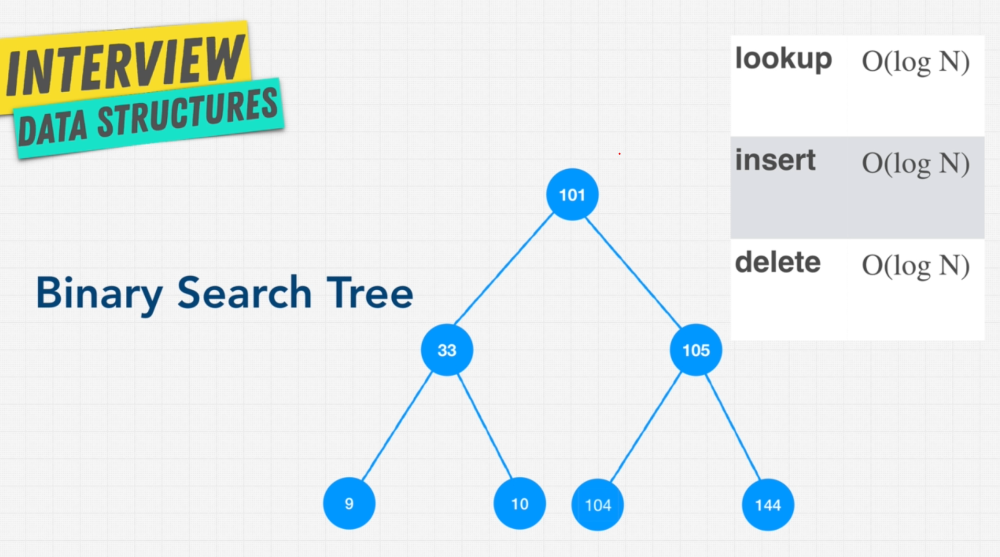
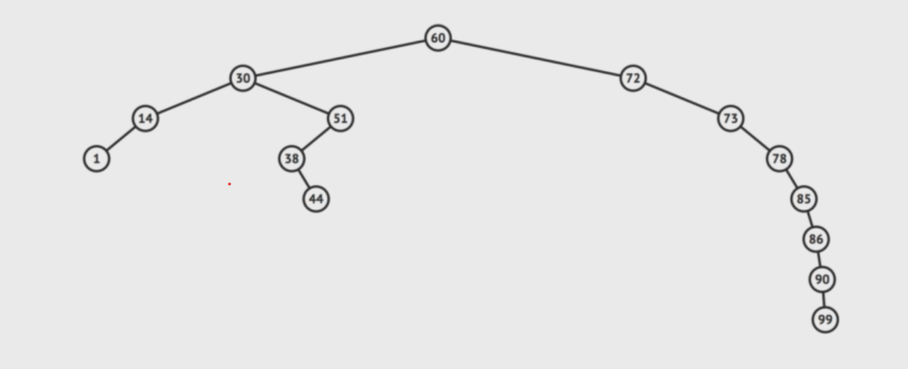

# 🌲 BST: A Type of Binary Tree

- Great for **comparing** things
- Great for **search** stuff
- Stores **relationships between the stores datapoints**

The cool diagram:

😲 **Observations:**

- The root node can have any value.
- The left child of a node will always have a **lower** value than the parent node.
- The right child of a node will always have a **higher** value than the parent node.
- The parent node will always have a value **greater than** any value in its left subtree and **less than** any value in its right subtree.

## 🤔 Balanced vs Unbalanced tree

Wow, we have the **optimal performance of the binary search tree** of `O(log N)` and we're happy?

Nay, we when the tree becomes **unbalanced** - which means it looses the relation that it should supposed to hold, it **quickly becomes the linked list** and gives is the performance of `O(n)` instead of `O(log n)`.

So,

| Operation    | Balanced Tree | Unbalanced Tree |
|--------------|---------------|-----------------|
| Insertion    | O(log n)       | O(n)            |
| Deletion     | O(log n)       | O(n)            |
| Lookup       | O(log n)       | O(n)            |

You see where is it going! 

> 💖✨
> 
> To solve this, we have methods **to balance the tress** like:
> - AVL Trees
> - Red Black tree

We will discuss them later, as these methods will **guerentee** that even after many insertions and deletions, we will have the `O(log N)` performance.

## BST Pros and Cons

### Binary Search Tree (BST) Cheat Sheet

#### Advantages and Disadvantages of Binary Search Tree (BST)

| **Advantage** | **Disadvantage** |
|---|---|
| **Efficient Search Operations** Average Time Complexity: O(log n). Due to the binary nature, each comparison skips about half of the remaining tree, making search operations significantly faster compared to linear structures. | **Unbalanced Trees** Worst-case Time Complexity: O(n). If the tree becomes unbalanced (e.g., resembling a linked list), the efficiency of search, insertion, and deletion operations degrades significantly. |
| **Efficient Insertion and Deletion** Average Time Complexity: O(log n). Insertion and deletion operations also benefit from the logarithmic time complexity in a balanced tree, allowing for efficient dynamic data management. | **Requires Balancing** Maintaining Balance: Additional algorithms needed. To keep the tree balanced and maintain O(log n) complexity, additional balancing algorithms (such as those used in AVL or Red-Black Trees) must be implemented, which adds complexity and computational overhead. |
| **Sorted Data** In-Order Traversal: O(n). In-order traversal of a BST produces elements in ascending order, which is useful for operations that require sorted data without additional sorting algorithms. | **Space Complexity** Pointer Overhead: O(n). Each node in the BST requires additional storage for pointers to its children, which can be significant, especially in memory-constrained environments. |
| **Dynamic Growth and Shrinkage** Flexible Size: Grows and shrinks with operations. A BST can dynamically grow and shrink with insertions and deletions, providing flexible data management without requiring a predefined size. | **Complexity of Algorithms** Advanced Operations: Complex to implement. Algorithms for balancing (like tree rotations in AVL or Red-Black Trees) can be complex to implement and understand, requiring a deeper understanding of tree dynamics. |
| **Simple Binary Structure** Ease of Implementation: Simpler than advanced trees. The basic binary structure of a BST is easier to understand and implement compared to more complex data structures like AVL or Red-Black Trees. | **Handling Duplicates** Value Duplication: Complicates structure. BSTs typically do not handle duplicate values well, and managing duplicates may require extra mechanisms, adding complexity to the structure. |

