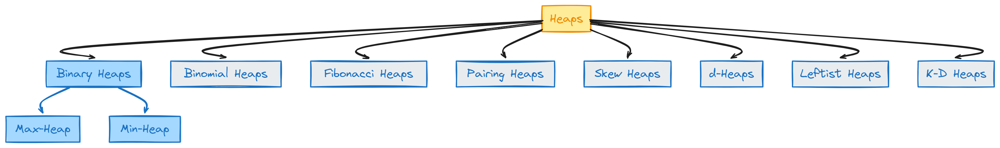

# Heap.

We will mostly encounter the **binary heaps**.

> ## 🔥 
> In binary tree, **every child points to the parent which has higher value**.

Now, that is an important consideration to make, buddy. All parents have the higher value than their child. This will help a lot in certain situations like:

- **Efficiently finding the maximum element**: In a max-heap, the highest value is always at the root (the top of the heap), which means you can access it in constant time, $O(1)$. This is particularly useful in priority queues where you need to quickly retrieve the highest priority item.

- **Maintaining heap property during insertion and deletion**: When inserting a new element or deleting the root in a max-heap, the heap property can be restored efficiently through the process of "heapify" or "sifting". Since each parent node is greater than its children, you can easily compare and swap elements to maintain the heap structure.

- **Efficient sorting using heapsort**: Heapsort takes advantage of the heap structure to sort elements. By repeatedly removing the maximum element from the heap and reconstructing the heap, you can sort an array efficiently in $O(n \log n)$ time. The property that each parent node is greater than its children ensures that the largest remaining element is always moved to the correct position in the sorted array.

- **Scheduling and resource management**: In scenarios like CPU scheduling or bandwidth allocation, max-heaps can be used to always allocate resources to the highest priority task first. The property that parents are greater than their children helps quickly identify and manage the most critical tasks.

---

## 1️⃣2️⃣ Types:

1. **Max Heap**: Root node has the highest value
2. **Min Heap**: Root node has the lowest value

But, there is more...

### ⌚ Time

- Lookup - `O(n)`
- insert - `O(log N)`
- delete - `O(log N)`

> 💭 *Used anywhere when the **ordering is important***.

### Hot stuff 🥵🥵

**Compared to BST** the **LookUp here is expensive**. Because there is no relationship like *go left or right, we will need to search through whole tree*.

## Ow, okay; if lookups are *that* slow, then why to use it over linkedlist?

✨ Well, **for comparison**. Matlab; **When you have a situation in which *you only want people greater than age 60, then just grab those!***.

### Where are they used?

1. Data storage
2. Sorting algos
3. Priority queues (we will see what is that)

## 😎🆒 A Cool Process While Insertion

> We will **always insert from left to right**. And this way, the tree **will never be unbalanced.**

Here, is a little GIF for you. Note how the new element is being added in the tree, see the left to right rule there.

# 🔥 Priority Queue

This is still **queue!** but here, we give the "priority" for the deletion.

Here, is the situation and why is this related with "heaps".

- As you know queues don't allow random insertion or deletion specifically.
- So to "remove" something, you need to remove the item based on the order it came in.
- Here, in the priority queue, **we remove the stuff based on their priority**, ie the highest value.
- Here, heap comes in. Heap always keeps track of the highest element on the top, so that we can remove the highest priority element first!! And **no random removals!**
- The items can be inserted at the end, like in the normal heap.

So in summary, *priority queue, is the heap, but with limited features than heap!*

Here is the ChatGPT summary:

| Feature            | Binary Heap                              | Priority Queue                                |
|--------------------|------------------------------------------|-----------------------------------------------|
| **Definition**     | Data structure that satisfies the heap property (max-heap or min-heap). | Abstract data type that supports efficient retrieval of highest (or lowest) priority element. |
| **Structure**      | Implemented as a complete binary tree stored in an array. | Can be implemented using various data structures (array, linked list, heap, etc.). |
| **Operations**     | Supports insertion, deletion (of root), and peek operations efficiently (O(log n) for insertions and deletions). | Defines operations like insert (enqueue), extract-max/extract-min (dequeue), and peek. |
| **Use**            | Commonly used to implement priority queues due to efficient heap operations. | Used in various applications where elements need to be managed based on their priority level. |