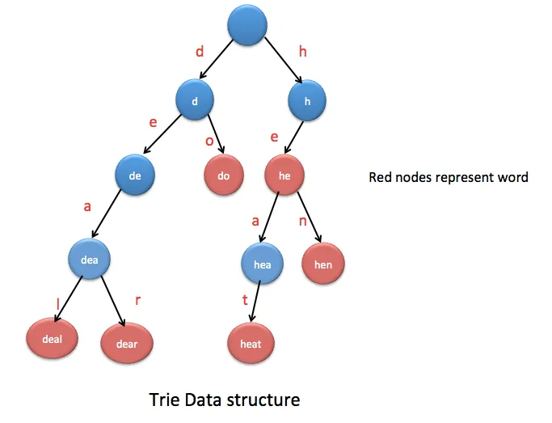

# A specialized Tree - for most occurring pairs?

Well, the title is vague as hell, but the tries "tries" to do some **similar** things along the way. Let's see:

- They are the trees *(of course)* but **they're not binary trees**.
- Most often they are used with **strings**.
- One of many applications is using in **type ahead**.


🔗 Read more about it here: [Medium Article](https://wangyy395.medium.com/implement-a-trie-in-python-e8dd5c5fde3a)

---

>  Each trie node has two components: a set of children that leads to the next trie node, and a **boolean** value defines if it is the end for the word.



## 🔮 A trie has some applications such as:

**Autocomplete:** when googling something, it will automatically predict the *rest of a word* a user is typing. Basically, it’s searching the prefix in a trie and provides the following words as options.

**Spell checker:** it checks if the user’s typing by searching the word in a trie(*dictionary*).

**Solving Boggle games:** starts with a random character in the given matrix, check whether it is a prefix in a trie(dictionary).

## 💉 Some operations for trie

### Basic Functions of a Trie

- **Insert a word**
- **Search for a word**
- **Check if a prefix exists**

### `1.` Insert a Word into a Trie

1. Start from the root.
2. For each letter in the word:
   - If the letter node exists, move to the next letter.
   - If the letter node doesn't exist, create a new node.
3. Mark the last node as the end of the word.

### `2.` Search if a Word Exists in a Trie

1. Start from the root.
2. For each letter in the word:
   - If the letter node doesn't exist, return False.
   - If the letter node exists, move to the next letter.
3. Check if the last node is marked as the end of the word.

**Example:**

```python
print(trie.search("cat"))  # Output: True
print(trie.search("can"))  # Output: False
```

### `3.` Check if a Prefix Exists in a Trie

1. Start from the root.
2. For each letter in the prefix:
   - If the letter node doesn't exist, return False.
   - If the letter node exists, move to the next letter.
3. If all letters are found, return True.

**Example:**

```python
print(trie.starts_with("ca"))  # Output: True
print(trie.starts_with("do"))  # Output: False
```
