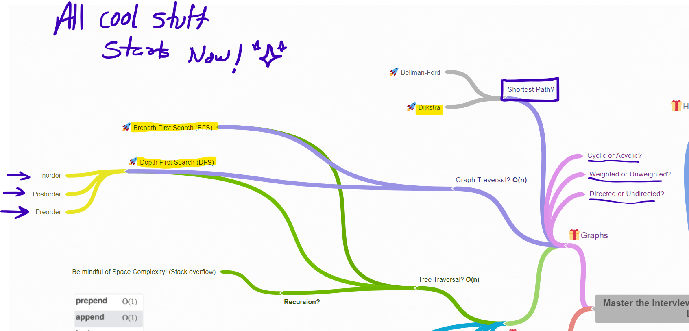
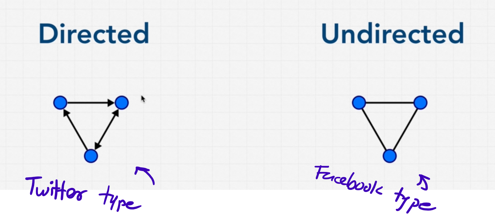
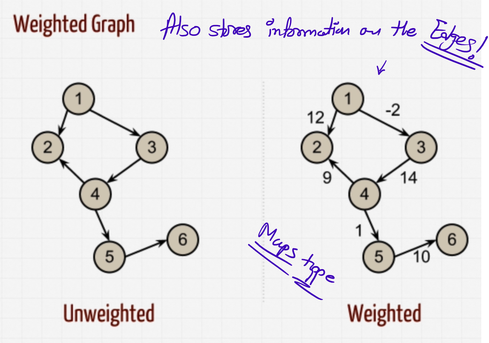
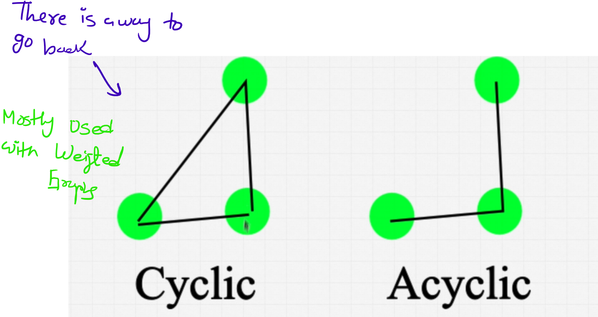
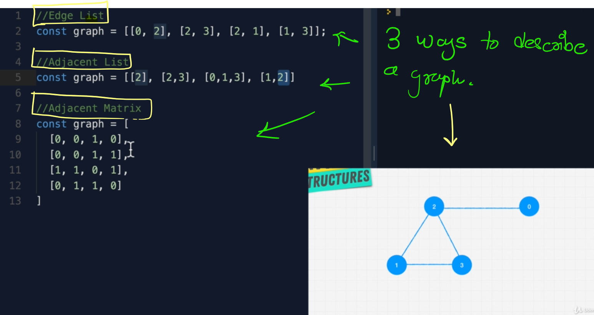

# ✨ Most important DS in modeling a real-life!

## Basic types

### ➡️ By direction

1. Directed
2. Undirected

### ⚖️ By weight

1. Weighted 
2. Unweighted

### 🔁 Cyclicity

1. Cyclic
2. Acyclic

## 🔀 Ways to describe graph

Here's a concise way to respond to that interview question:

### `1.` Adjacency Matrix

**Better for:**

- Dense graphs (many edges).
- Quick edge existence checks (O(1) time complexity).
- Graphs where you need to frequently check for the presence of specific edges.

**Usage:**

- When you have a dense graph with many edges.
- When you need constant-time edge checks.

**Pros:**

- Simple and straightforward.
- Constant-time complexity for checking if an edge exists between two vertices.

**Cons:**

- Requires O(V^2) space, even if the graph is sparse.
- Inefficient for graphs with a large number of vertices but few edges.

### `2.` Adjacency List

**Better for:**

- Sparse graphs (few edges).
- Iterating over all edges.
- Space-efficient storage.

**Usage:**

- When you have a sparse graph.
- When you need to efficiently iterate over the neighbors of a vertex.

**Pros:**

- Space-efficient, requiring O(V + E) space.
- Easy to iterate over all edges.

**Cons:**

- Checking for the existence of a specific edge can take O(V) time in the worst case.

### `3.` Edge List

**Better for:**

- Storing and iterating over all edges.
- Scenarios where edge-related operations are frequent.

**Usage:**

- When you need a simple representation of edges.
- When you need to process all edges frequently.

**Pros:**

- Simple to implement.
- Efficient for algorithms that need to process all edges.

**Cons:**

- Inefficient for checking if a specific edge exists (O(E) time complexity).
- Not ideal for quickly accessing the neighbors of a vertex.

### Summary

- **Adjacency Matrix:** Use for dense graphs or when you need quick edge existence checks.
- **Adjacency List:** Use for sparse graphs or when you need efficient neighbor iteration.
- **Edge List:** Use for edge-centric operations and simple implementations.

## Pros Cons of Graphs

Sometimes **graphs are indispensible** in certain scenarios, where we must have to use the graphs. They come to picture when there is "relationships" in the data.

# Pros and Cons of Graphs Data Structure

| **Pros**                                                                 | **Cons**                                                                 |
|--------------------------------------------------------------------------|--------------------------------------------------------------------------|
| **Efficient Representation of Networks:** Graphs are ideal for representing networks like social networks, computer networks, and transportation systems. | **Complexity:** Graph algorithms can be complex and difficult to implement. |
| **Flexibility:** Graphs can represent a wide variety of relationships and can be used for many types of applications. | **Memory Consumption:** Storing large graphs can require significant amounts of memory, especially with adjacency matrices. |
| **Pathfinding:** Graphs are excellent for finding the shortest path, such as in GPS navigation systems. | **Computation Time:** Operations like finding the shortest path or maximum flow can be time-consuming for large graphs. |
| **Modeling Real-World Problems:** Graphs can model many real-world problems, from network traffic to ecological systems. | **Data Management:** Managing and updating the data in a dynamic graph can be challenging. |
| **Algorithm Support:** There are many well-studied algorithms for traversing and searching graphs, like DFS and BFS. | **Scalability Issues:** Large-scale graphs can be difficult to manage and process efficiently. |
| **Visualization:** Graphs can be easily visualized to provide intuitive understanding of complex relationships. | **Edge Representation:** Handling weighted, directed, and undirected edges can complicate the data structure. |

