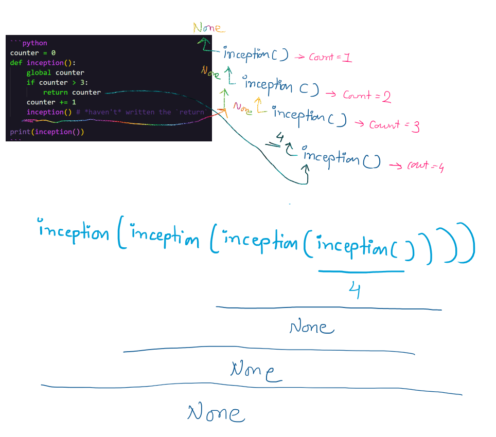

# 📞 Call yourself.

> *"If you fail to plan (base case), you plan to fail."*
>
> - Taylor Swift (Mastermind)

## ⚾ Base Case

Recursive funtion always has `2` paths:

1. Call the function itself.
2. Stop when hit the base case.

## 🧠 Always Keep in Mind to `return`

- Your base case may return a value, but **if** that returned value isn't returned by the caller function, then that value will be lost.

### 🌟 Let's visualize the function below:

```python
counter = 0
def inception():
    global counter
    if counter > 3:
        return counter
    counter += 1
    inception() # *haven't* written the `return`

print(inception())
```



## 🔴 The `O(2^n)` *(exponential)* complexity!

- Make sure where are we using the recursion!
- The computation time grows exponentially in the recursion.

That means, if you were to implement a fibonacci calculator for say 100 values, then:

- Iterative approach would take `50` calculations.
- Recursion would take `1125899906842620` calculations.

### 👼🏻 Well, recursion can be made `O(n)`!!

THROUGH **DYNAMIC PROGRAMMING** 🔥🔥🔥

The above is definitely a BIG GUN. 

## 😕 ANYTHING which can be implemented recursively, can be implemented through LOOP.

So, when *exactly* should we use that?

- Really, depends on the situation.
- Recursion can make code DRY.

# 👍🏻👎🏻 Pros and Cons of Using Recursion

| **Pros** 👍🏻                                               | **Cons** 👎🏻                                                  |
|---------------------------------------------------------|-----------------------------------------------------------|
| **Simpler Code:** Recursive solutions can be more intuitive and easier to write, especially for problems that have a natural recursive structure. | **Performance:** Recursive solutions can be slower due to function call overhead. |
| **Elegant Solutions:** Many problems can be elegantly solved with recursion, leading to more readable code. | **Memory Usage:** Recursion uses the call stack, which can lead to high memory usage and potential stack overflow for deep recursion. |
| **Divide and Conquer:** Recursion is useful for divide-and-conquer algorithms like quicksort and mergesort. | **Debugging:** Debugging recursive code can be more challenging due to the complexity of the call stack. |
| **Mathematical Problems:** Ideal for problems defined by recursive relations, such as Fibonacci and factorial calculations. | **Efficiency:** Naive recursive solutions can be inefficient and may require optimization techniques like memoization. |
| **State Management:** Recursive functions can maintain state implicitly through the call stack, which can simplify the code. | **Limited by Stack Size:** The depth of recursion is limited by the maximum stack size, making it unsuitable for very deep recursions without optimization. |

## 🌟 So, when EXACTLY use recursion?

**When a problem is...**

1. Divided into a number of subproblems that are smaller instances of the same problem.

2. Each instance of the subproblem is identical in nature.

3. The solutions of each subproblem can be combined to solve the problem at hand.