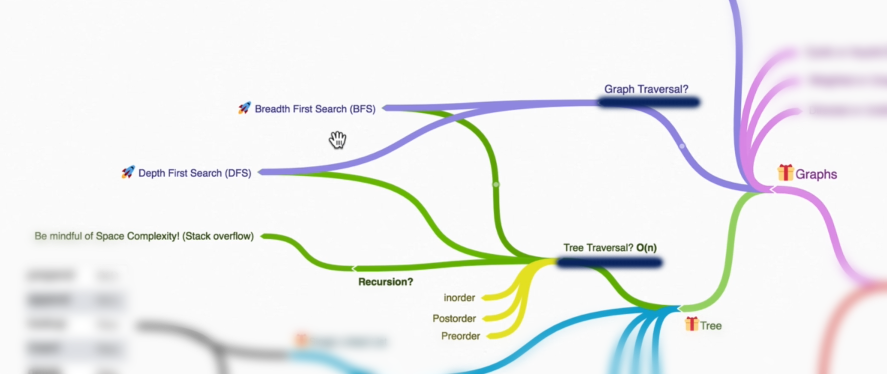

# 🔎 Searching and Traversals 🚶🏻

1. Linear search
2. Binary search
3. Depth first search
4. Breadth first search

## 🔍 Searching

### `1.` Linear Search

Meh, you know this. No need to spend time on this. This has `O(n)` time.

### `2.` Binary search

The main line is: "**if in linear search, you know that your list is `sorted`, then? Would you be able to improve on that?**".

That is the main base of this binary search algorithm. We ***split*** the list in halves and keep splitting until we know where our value would lie.

For example if the list is: `[1, 3, 5, 8, 35, 44, 99]` then when you want to find 44, you would split the array in half, making `[1, 3, 5, 8]` and `[35, 44, 99]` and keep doing that for the left or right of the array. 

We will decide whether to keep splitting on the left side or right side **based on the middle number**.

*(Binary search is already implemented in the BST.py code)*

## 🚶🏻 Traversals

- Used when we want to traverse some graph or tree.
- Not necessarily the trees, but graphs too.

For **Trees**:

- BFS
- DFS
- In-order
- Pre-order
- Post-order

For **Graphs**:

- BFS
- DFS
  
### `1.` Breadth First Search

- Traverse by **level**.
- Visit parents first then their children.
- Left to right *or* Right to left.

> 📝 Needs to keep track of the children in order. So, needs memory.

| PROS | CONS |
|---|---|
| Shortest path | More memory |
| Closer nodes   (if we know the node is on the upper level - good) | |

### `2.` Deapth First Search

- Traverse until the **leaf node** is reached
- Once the leaf is reached, explore the sibling children.

> 📝 No need extra memory or store the child. So, no need of memory.

| PROS | CONS |
|---|---|
| Less memory | Can get slow |
| Does the path exist? | |

## Breadth-First Search (BFS) vs. Depth-First Search (DFS)

| **Criteria**            | **Breadth-First Search (BFS)**                            | **Depth-First Search (DFS)**                             |
|-------------------------|------------------------------------------------------------|----------------------------------------------------------|
| **Traversal Method**    | Explores all neighbors at the present depth before moving on to nodes at the next depth level. | Explores as far as possible along each branch before backtracking. |
| **Data Structure**      | Uses a **queue** to keep track of the next node to visit. | Uses a **stack** (can be implicit with recursion) to keep track of the path. |
| **Implementation**      | Iterative, typically using a queue.                       | Can be implemented both iteratively (using a stack) and recursively. |
| **Optimal for Shortest Path** | Yes, BFS is optimal for finding the shortest path in an unweighted graph. | No, DFS does not guarantee the shortest path. |
| **Space Complexity**    | O(V) where V is the number of vertices (due to the queue).| O(V) for the recursive stack space in the worst case (or the stack in an iterative implementation). |
| **Time Complexity**     | O(V + E) where E is the number of edges.                  | O(V + E) where E is the number of edges.                  |
| **When to Use**         | Use BFS when the shortest path is needed or for level-order traversal. | Use DFS when you need to explore all nodes and paths, or when you want to check for cycles. |
| **Examples of Use Cases**| Shortest path in unweighted graphs, level-order traversal of trees, finding connected components in a graph. | Pathfinding in mazes, topological sorting, solving puzzles like Sudoku. |
| **Node Exploration Order**| Explores nodes level by level.                          | Explores nodes depth by depth.                           |
| **Handling Cycles**     | Easily handles cycles with a visited set.                 | Can handle cycles with a visited set or by marking nodes. |

## 📜 When to use which

### Cheat Sheet for When to Use BFS and DFS

- **If you know a solution is not far from the root of the tree:**
  - **BFS**

- **If the tree is very deep and solutions are rare:**
  - **BFS** - DFS will be slower and may hit stack overflow.

- **If the tree is very wide:**
  - **DFS** - BFS will need too much memory to store all nodes at the current level in a queue.

- **If solutions are frequent but located deep in the tree:**
  - **DFS**

- **Determining whether a path exists between two nodes:**
  - **DFS** - Both DFS and BFS can be used, but DFS is often simpler for this task.

- **Finding the shortest path:**
  - **BFS** - Especially in unweighted graphs, as it guarantees the shortest path.
