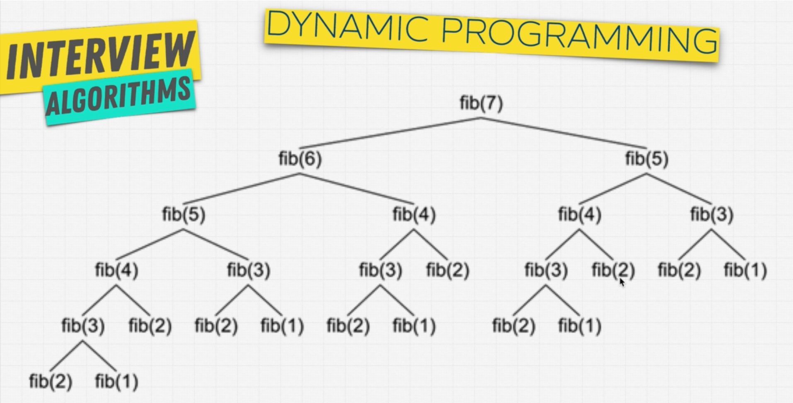

# Dynamic Programming

A buzzword, but really important. It really **is nothihg**. It just is dependent on the single concept of `caching`.

> 👉🏻 *"Dynamic programming is a way to break the problems into small sub-problems, solving each of them, and storing their solutions. Next time, the same sub-problem occurs, use the solved solution of that sub-problem."*

## Caching == Memoization 🧠




## ✨ Follow these steps to decide whether the DP is supported!!!

1. Can be divided into subproblem
2. Recursive Solution
3. Are there repetitive subproblems?
4. Memoize subproblems
5. Demand a raise from your boss!!!

It's easy, store the subproblems in the cache, dict. That's done. No need to implement.

Always show the dynamic programming with the fibonacci sequence:
```python
def fib(n):
    if n < 2:
        return n

    return fib(n - 1) + fib(n - 2)
```

Cool!